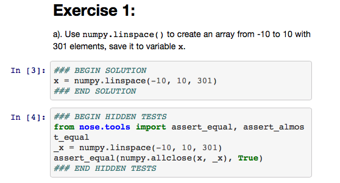
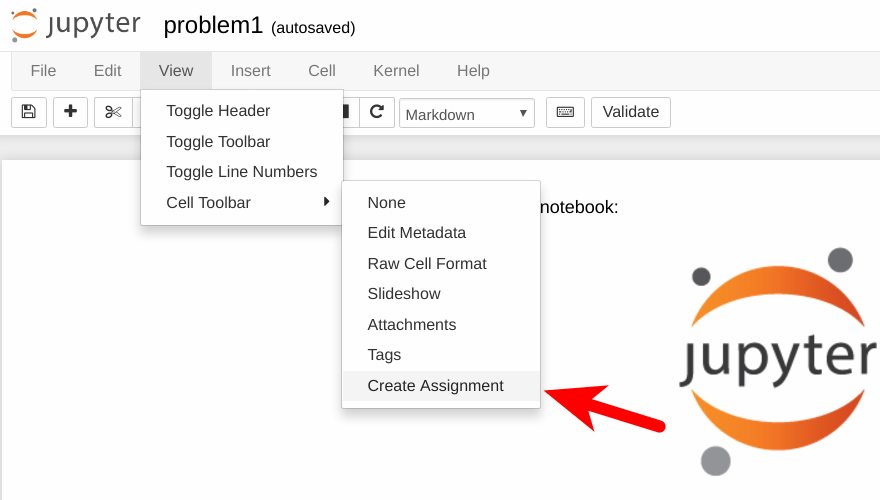
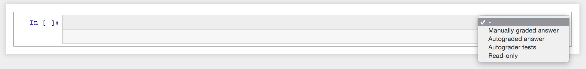

# Course Development Guide

by **Lorena A. Barba**, Vice President of NumFOCUS Academy

## General design

Each course consists of written materials provided as Jupyter notebooks (in this repository), accompanying videos, and student assignments/assessments. 
The written materials must be on Jupyter notebooks because the course building process pulls content directly from notebooks in a GitHub repository to display a learning sequence in the online course platform.
All the videos will need to be uploaded to the NumFOCUS YouTube channel, and will be embedded in the course sequences.

NumFOCUS will build an online course with the materials provided by the instructors on our Open edX platform.
The instructors' content is always open access and free: videos on  YouTube, and notebooks in this GitHub repository (under standard public licenses). 
To access the learning sequences on the Academy platform, participants need to be registered. 

The materials should include an outline that traces a path through the content, with signposts of where each video and other elements (like exercises) should go.


## Infrastructure

NumFOCUS has deployed an ecosystem of tools and platforms to provide online learning experiences. 
Course instructors will be able to exploit these tools to make their content shine.

### Course platform

We maintain a full-fledged online course platform, using the [Open edX software](https://open.edx.org/about-open-edx/). 
With your materials (video and Jupyter notebooks), volunteers and NumFOCUS staff will build an online course. 
It can include quizzes and auto-graded "homework" exercises, to reinforce the partcipants' learning, as described below.

The course platform includes a custom extension for creating course content _from any publicly available Jupyter notebook_, using its URL. 
Pulling content from Jupyter notebooks allows us to build a learning sequence from the author-provided content, without duplication.

We also have a custom extension that allows writing exercises for the participants that are tested on-the-fly for correctness. 
This allows creating Jupyter-based student assignments that are auto-graded in the platform.

### JupyterHub/MyBinder

NumFOCUS Academy will maintain a dedicated JupyterHub server that all subscribers will have access to. 
Learners can launch a JupyterHub session with the notebooks provided by the instructor, so they can interact with the computable content. 

In your outline, you can specify places in the course content where you want learners to find a "Launch Lab" button, which will launch a Jupyter session with your notebooks pre-loaded. 
You need to provide an environment definition, either in the form on a `requirements.txt` file (for pure Python envionments) or an `environment.yaml` file (for conda environments) at the root of your repository.


## Guide to crafting your materials

### Jupyter notebooks

Your course should be written as a set of Jupyter notebooks—about four fully narranted notebooks—walking your reader through the complete path to achieve the learning objectives. 

Each Jupyter notebook is "one lesson" and will correspond to "one section" in the online course. 
Printed, it should be between 10 and 20 pages in length, equivalent to 17 to 35 minutes reading time. 
The computational portions should be presented as worked-out examples, broken down into steps, and narrated. 

Because the Jupyter notebooks will be ingested into the content management system of the learning platform, to display learning sequences, it is _very important_ that you break up the notebook in sections and sub-sections. 
The section headings, marked by `#`, `##` and so on, will be used as delimiters in the learning sequence to display portions of your notebook. 
That way, the learning sequence can interleave content from the notebooks, videos, self-assessments (e.g., multiple choice quiz), graded Jupyter notebooks, etc.

In other words, your Jupyter notebooks are like the "textbook," while a learning sequence mixes this content with other experiences or activities.

Since the content is pulled dynamically from your notebooks on GitHub, you will be able to continue editing the notebooks after the online course is built.
As long as you have provided an accurate outline, and you do not make changes to section and sub-section headings, the course building process can go on in parallel to your final edits.
To be specific: each time a participant visits a section in the course, the Jupyter viewer extension we added to the platform will pull the notebook from its public URL, run `nbconvert`, and display the HTML output.

Building online courses in this way allows us to have the full display richness of Jupyter notebooks: beautiful equations, embedded images in the markdown, syntax-highlighted code, plot outputs, etc. 

**Pro tip**: while you are developing your content as Jupyter notebooks, always _clear output_ before pushing to the repository.
This will facilitate diff-viewing and keep the repo smaller. 
Only push the notebooks with output once you feel they are done. 
If you later fix a typo or make a small edit to markdown cells, push the change without re-running the notebook.

### Videos

The course videos should be short and content-dense.
(Read the [tweet thread by @gregork](https://twitter.com/gregork/status/1291760045269508096) about online videos.)

They can be recorded as a screencast of you live coding and narrating, a slide-based presentation, a camera capture of yourself explaining or narrating some concept, or a mix of all these. 

NumFOCUS will prepare a streamlined workflow for you to deliver the videos, so they can be uploaded to our YouTube channel.


### Slides

If you will have any portions of your presentation using slides, you can include them in the repository. 
We strongly encourage the use of text-based source for slides.

### Labs and self-assessments

A course should provide several opportunities for learners to self-assess, and we ask instructors to provide these. 
We request that you share the assessments with us privately (i.e., they should not be included in the public repository).

You can craft simple multiple-choice questions to supplement video or written content. In this case, please provide them to us in this markdown format, so we can embed them in the course:

```
>>Statement of the question <<

( ) wrong answer
(x) right answer
( ) wrong answer
( ) wrong answer

[Explanation]
A short explanation to help learner get it right next time.
[Explanation]
```

Open edX offers several [core problem types](https://edx.readthedocs.io/projects/open-edx-building-and-running-a-course/en/open-release-ironwood.master/exercises_tools/create_exercises_and_tools.html#core-problem-types), and we can accommodate any of these in your course. 
Please discuss with us by emailing to: 
[academy-admin@numfocus.org](mailto:academy-admin@numfocus.org)

### Jupyter auto-graded notebooks

For the course to be most effective, you should include exercises for the learners. 
These exercises, written as Jupyter notebooks, can be auto-graded in the course platform. 
For that, you need to write the exercises in a format that allows using `nbgrader` to create an assignment. 
We have developed an integration in the course platform that allows  running `nbgrader` in a container and checking the learner's assignment, at the click of a button.

Each exercise should be divided into incremental steps, and you provide the solution, and a test, usign the `nbgrader` annotations. 
See the [`nbgrader` documentation](https://nbgrader.readthedocs.io/en/stable/user_guide/creating_and_grading_assignments.html#autograded-answer-cells) for detailed instructions on how to insert an "Autograded answer" and an "Autograded test."

Here is an example: 



In the screenshot above, the solution is in cell 3. After we process the notebook, the code between the marks `### BEGIN SOLUTION` and `### END SOLUTION` will be replaced by a note to the learner to "write your code here." 

The tests in cell 4 will be hidden from the learner, but will be active and used to check the learners code against the correct answer.

Your assignment notebook should include all the needed `import` statements at the top, and you should include `nose` in the `requirements.txt` (as well as all other dependencies, with their versions).

You will need to [install](https://nbgrader.readthedocs.io/en/stable/user_guide/installation.html) the `nbgrader` Jupyter extension. 
You will only be using the "Create assignment tool," and do not need to follow the later steps to create a student's version of the assignment, as this will be done automatically on the platform.

Open the raw version of your assignment notebook in the environment where you installed `nbgrader`, and you should have the option shown in the screenshot below:



Select "Create Assignment." Every notebook cell should now have a selector to pick the cell type, as shown below:



Work down the notebook making a selection for every cell:

- "Read-only" for markdown cells with instructions, and cells with `import` commands that you don't want anyone to mess with.
- "Autograded answer" for code cells that contain the solutions.
- "Autograded test" for code cells that contain teh tests.

Save the notebook, and this is the version you should send to us. We will create a _private repository_ for all the assignment notebooks. 
Don't include them in the public course repository.

**Pro Tip**: Use a rational naming convention for your assignment notebooks with a prefix for your course, and a consecutive number for the assignment.

**We strongly encourage courses to be complemented by autograded exercises.**

